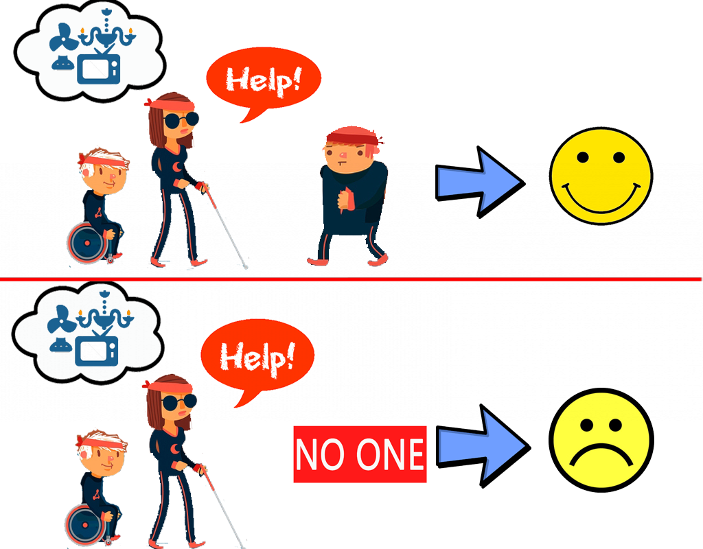
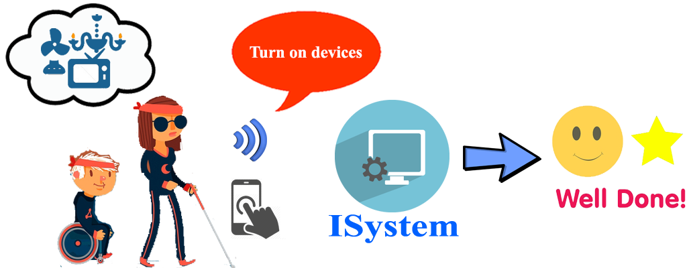
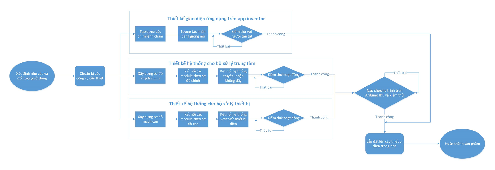

# DoAn1-THNMCNTT2
Team members:
- Phạm Thành Kỳ Hưng
- Nguyễn Duy Tâm
- Nguyễn Văn Quang Huy
- Trịnh Hoàng Việt
- Phan Hồng Hạnh Trinh
- Trần Phước Lộc

**Project: Quy trình xây dựng hệ thống hỗ trợ người khuyết tật sự dụng thiết bị địện trong nhà**
 
**Mô tả:**

Quy trình cũ:

Quy trình mới:

**Product Backlog:** As a / an 
- [x] Người đọc bài viết
- *I want to:* Tìm thông tin về những sản phẩm hỗ trợ người khuyết tật
- *So that:* Để có thể giúp đỡ người thân trong gia đình
- [x] Người đọc bài viết nhưng chưa có đủ kiến thức 
- *I want to:* Tìm hiểu kiến thức nền tảng
- *So that:* Để có thể thao tác với các thiết bị nhúng
- [x] Người đọc bài viết đã đủ kiến thức
- *I want to:* Được tư vấn vật dụng cần có khi thực hiện và được hướng dẫn khi có lỗi
- *So that:* Tiết kiệm thời gian và tránh rủi ro khi thực hiện
- [x] Người đọc đã thành thạo
- *I want to:* Được tư vấn thiết kế giao diện hệ thống
- *So that:* Để thiết bị làm ra gọn, đẹp, đảm bảo an toàn, dễ sử dụng
- [x] Người chủ thiết bị
- *I want to:* Được chia sẻ kinh nghệm trong quá trình làm
- *So that:* Để các bạn đọc khác tham khảo và rút kinh nghiệm

**Quy trình xây dựng hệ thống:**

**Poster:**

